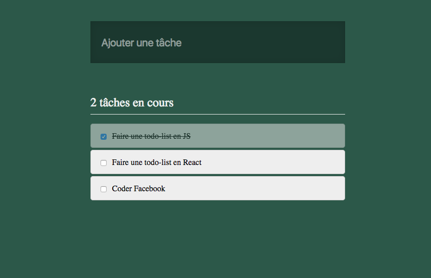

# Todolist en React

On a déjà créé une todolist en Vanilla JS.  
Voyons ce que ça donne, en React cette fois-ci :smiley:

Refaire la todolist du premier challenge !  
Même design, mêmes fonctionnalités, méthode différente.

## Objectifs

Mise en place

- Découper puis créer les composants en modularisant au maximum
- Gérer la structure et les styles
- Placer les props
- Dynamiser l'affichage avec des données provenant du fichier `tasks.js`

State

- Définir le `state` dans App (première étape : transformer App en class)
- Stocker les tâches de `tasks.js` dans le `state`
- Calculer le compteur de tâches non-effectuées à partir des données du `state` ... et s'en servir :)
- Dynamiser tout l'affichage avec les données du `state`
- Créer un composant contrôlé pour le champ
- Ajouter une nouvelle tâche (attention à ne pas "modifier" le state mais à le remplacer ;) )

## BONUS

- Gérer le cas : cocher une tâche
- Ordonner les tâches
  - En haut, les tâches non effectuées
  - Ensuite, les tâches effectuées
